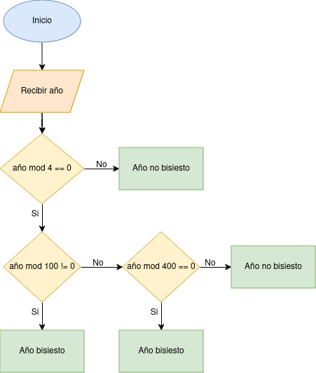

# README
Calculadora de año bisiesto desarrollado en ensamblador x86/64 con interfaz gráfica en gtk3 en C

## Sobre el proyecto
Tarea 2 <br />
En este programa se desarrolló una calculadora de añó bisiesto utilizando el ensamblador `NASM` de la arquitectura x86-64. También se implementó una interfaz gráfica en gtk3 con C <br />
A continuación se encuentra el diagrama de flujo que representa la ejecución del programa


<br />


## Integrantes
- Macey Bourrouett Obando - C11183 <br /> 
- Iván Marín Cordero - C24524


## Instalación
1. Clonar el repositorio
```
git clone https://github.com/virtualbomy/Calculadora.git
```  
2. Abrir la terminal en la carpeta resultante y para ejecutar el programa escribir el comando
```
 make run
```
3. Escribir el comando para abrir el debug
```
make debug
```
4. Para eliminar los archivos generados utilizar el comando 
```
make clean
```

## Uso
1. Necesita instalar GTK3, para que el programa funcione de manera correcta.
2.Al ejecutar el programa utilizando el comando "make run", aparecerá en pantalla un cuadro que le pedirá que ingrese en el área asignada el año que desea calcular y presione el botón de "Calcular". Después aparecerá en pantalla un mensaje diciendo si el año ingresado ES o NO bisiesto
 

 
